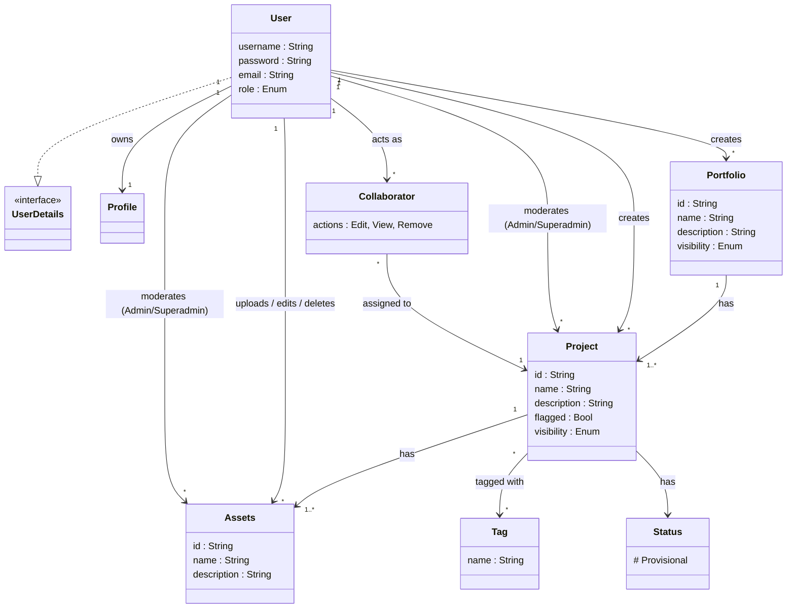

# MyPortfolios GEI API

Template for a Spring Boot project including Spring REST, HATEOAS, JPA, etc. Additional details: [HELP.md](HELP.md)

## Vision

**For** ... **who** want to ...
**the project** ... **is an** ...
**that** allows ...
**Unlike** other ...

## Features per Stakeholder

| CREATOR                                   | ADMIN                | ANONYMOUS                    |
|-------------------------------------------|----------------------|------------------------------|
| Register                                  | Add Admin            | View public creator profiles |
| Login                                     | Login                | List public portfolios       |
| Logout                                    | Logout               | List portfolio projects      |
| Edit profile                              | Suspend Creator      | List project content         |
| Create portfolio                          | List flagged content | Search public content        |
| Edit portfolio                            | Remove content       | Report public content        |
| Create project                            |                      |                              |
| Edit project                              |                      |                              |
| Add content                               |                      |                              |
| Edit content                              |                      |                              |
| Create tag                                |                      |                              |
| Tag content                               |                      |                              |
| Set public / private / restricted         |                      |                              |
| Share restricted with user                |                      |                              |
| List public and shared portfolios         |                      |                              |
| List public and shared portfolio projects |                      |                              |
| List public and shared project content    |                      |                              |
| Search public and shared content          |                      |                              |
| Report content                            |                      |                              |

## Entities Model

